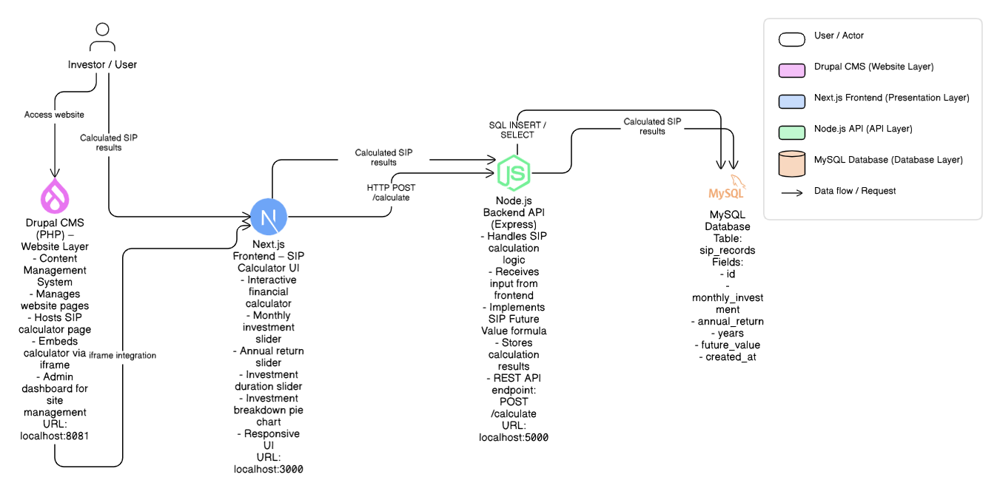

# SIP Investment Calculator

An interactive SIP calculator built to improve investor education.

## Tech Stack
- Next.js
- Node.js
- MySQL
- Drupal CMS
- PHP

## Features
- Interactive sliders
- Investment breakdown chart
- SIP future value calculation
- Responsive UI
- CMS integration

## Architecture
User → Drupal CMS → Next.js Calculator → Node API → MySQL

## System Architecture

## Demo Video
https://github.com/user-attachments/assets/2ba3ae6a-cc45-4af7-95d3-52fe06ab6e79